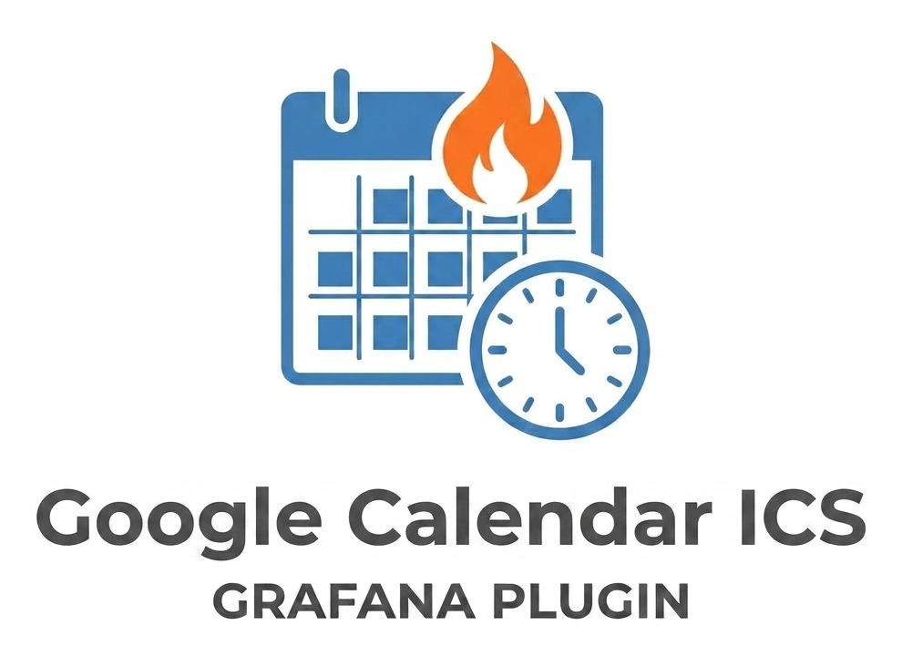

# Google Calendar (ICS) Datasource for Grafana




A Grafana datasource plugin that turns a public **Google Calendar ICS/iCal feed**
into queryable panel data — tables, or a real calendar view via the
[Calendar panel](https://grafana.com/grafana/plugins/marcusolsson-calendar-panel/).

## Why a backend plugin?

Google's calendar export (`.../basic.ics`) does not send CORS headers, so a
purely frontend plugin that fetches it directly from the browser fails. This
plugin ships a small **Go backend** that fetches and parses the ICS feed
server-side. As a side effect, the calendar URL is stored as an encrypted
secret and is never sent to the browser.

## Features

- Fetches the ICS feed server-side (no CORS issues)
- Parses recurring events (`RRULE`), exceptions (`EXDATE`), and individually
  moved/cancelled occurrences (`RECURRENCE-ID` / `STATUS:CANCELLED`) — the
  pattern Google Calendar uses for edited recurring events
- ICS URL stored as an encrypted secret, never exposed to the browser
- Optional per-query result limit ("Max events")
- All-day events are anchored to the calendar's own time zone
  (`X-WR-TIMEZONE`), not UTC, so they render as exactly one day regardless
  of the viewer's time zone
- Configurable title → color-value rules ("Color rules"), so calendar panels
  that color events via numeric thresholds (e.g. Business Calendar) can
  highlight specific events without editing the panel every time
- Multiple calendars per data source: add any number of additional ICS URLs,
  fetched concurrently and merged into one combined, time-sorted result —
  color rules apply across all of them automatically

## Installation

This plugin is unsigned (private/custom plugin, not published to the Grafana
catalog), so it's installed manually:

1. Build it (see [Development](#development) below) or grab a prebuilt
   `dist/` for your platform.
2. Copy the `dist/` contents to
   `<grafana-plugins-dir>/custom-googlecalendarics-datasource/` on your
   Grafana server.
3. Allow the unsigned plugin in `grafana.ini`:

   ```ini
   [plugins]
   allow_loading_unsigned_plugins = custom-googlecalendarics-datasource
   ```

4. Restart Grafana.

## Configuration

**Administration → Data Sources → Add data source → "Google Calendar ICS"**

| Field | Description |
|---|---|
| ICS-URL | Public iCal URL from Google Calendar (Settings → *Integrate calendar* → *Public address in iCal format*, usually ends in `/basic.ics`). Stored encrypted. |

Click **Save & Test** — the backend fetches the feed and reports how many
events it found in the next month.

## Multiple calendars

The ICS-URL field above is the **primary** calendar. To merge in more
calendars, use **"Weitere Kalender"** (additional calendars) further down on
the same page: click **"Kalender hinzufügen"** for each extra ICS feed, give
it a name (used to fill the `calendar` response field, see below) and its
URL.

All configured calendars are fetched concurrently and their events merged
into a single, time-sorted result — [color rules](#color-rules) are applied
across the merged set, so a rule doesn't need to be duplicated per calendar.

If one calendar fails to fetch or parse, it doesn't fail the whole query as
long as at least one other configured calendar still succeeds: the panel
gets the events from the working calendar(s) plus a warning notice naming
the one that failed (visible via the panel's notice icon). "Save & Test"
behaves the same way, naming any failed calendar in its message.

## Color rules

Google's ICS export doesn't include per-event color — Google only exposes
that via its own (OAuth) API, never through the public iCal feed. Calendar
panels that color events from data (e.g. Business Calendar) work around this
by coloring events from a *numeric* field compared against panel-configured
**Thresholds** (Standard options → Thresholds) — Business Calendar in
particular only supports three color layouts (`frame`, `event`,
`thresholds`), none of which read a color directly out of the data.

"Color rules", configured on the data source itself (**Administration → Data
Sources → Google Calendar ICS → Color rules**), bridge that gap: each rule
maps a text pattern to a number, and the backend writes the value of the
first matching rule into a new `color_value` field on every event.

| Field | Description |
|---|---|
| Stichwort (pattern) | Case-insensitive substring matched against the event title. |
| Wert (value) | Number written to `color_value` for matching events. Must match one of the threshold steps prepared in the panel (see below) — Grafana's threshold logic assigns the *highest step the value still reaches or exceeds*, not an exact match, so using the same numbers on both sides avoids a value landing on the wrong step. |

Rules are evaluated top to bottom; the **first** matching rule wins. Events
matching no rule (or when no rules are configured) get `color_value = 0`.
Existing configurations without any color rules keep working exactly as
before.

**One-time panel setup** (no sync script, no automation — set this up once
manually with some headroom for future categories):

1. Panel → Standard options → **Thresholds**: prepare enough steps up front, e.g.

   ```json
   "thresholds": {
     "mode": "absolute",
     "steps": [
       { "value": null, "color": "gray" },
       { "value": 10, "color": "blue" },
       { "value": 20, "color": "orange" },
       { "value": 30, "color": "red" }
     ]
   }
   ```

2. Panel option **Colors** → `thresholds`
3. Panel option **Data → Color field** → `color_value`

As long as an unused threshold step is still free, adding a new category
afterwards only means adding a rule in **Color rules** with a value matching
one of the free steps — the panel itself doesn't need to be touched again.
Once every prepared step is taken, a new step has to be added to the panel
manually (there's no automatic sync between color rules and panel
thresholds by design).

## Query options

| Field | Description |
|---|---|
| Max. Termine (max events) | `0`/empty = unlimited. Caps the number of rows returned per query. |

## Fields returned

| Field | Type | Description |
|---|---|---|
| `time` | time | Event start |
| `end_time` | time | Event end |
| `title` | string | Summary |
| `location` | string | Location |
| `description` | string | Description |
| `all_day` | bool | `true` for all-day events |
| `uid` | string | Calendar event UID |
| `color_value` | number | Value of the first matching [color rule](#color-rules), `0` if none match or none are configured |
| `calendar` | string | Name of the [additional calendar](#multiple-calendars) the event came from; empty string for the primary calendar |

## Building a calendar view

Field names line up directly with the [Business Calendar
panel](https://grafana.com/grafana/plugins/marcusolsson-calendar-panel/)
(`marcusolsson-calendar-panel`, formerly "Calendar" by Marcus Olsson, now
maintained by Volkov Labs): install it, then map `time` → *Time field*,
`end_time` → *End time field*, `title` → *Text field*, `location` →
*Location field*.

## Known limitations

- `EXRULE` (deprecated, essentially never produced by Google Calendar) is ignored
- `RDATE` (extra occurrences added without their own `RRULE`) is not evaluated
- Timezones are resolved via the `TZID` parameter against the host's IANA
  timezone database; falls back to UTC if resolution fails
- All-day events are anchored to the calendar's `X-WR-TIMEZONE`; if a feed
  doesn't set that property, all-day events fall back to UTC (which can
  reintroduce the two-day rendering issue for viewers in a non-UTC time zone)

## Development

Requires Node.js ≥18 and Go ≥1.21, plus [Mage](https://magefile.org/).

```bash
# Frontend
npm install
npm run dev     # watch mode
npm run build   # production build

# Backend
mage -v build:linux   # or build:windows / build:darwin / buildAll

# Tests
npm run typecheck
npm run lint
go test ./...
```

Webpack, tsconfig, and the Mage build targets under `.config/` are managed by
`@grafana/create-plugin` — don't hand-edit `.config/`.

## License

Apache-2.0, see [LICENSE](LICENSE).
